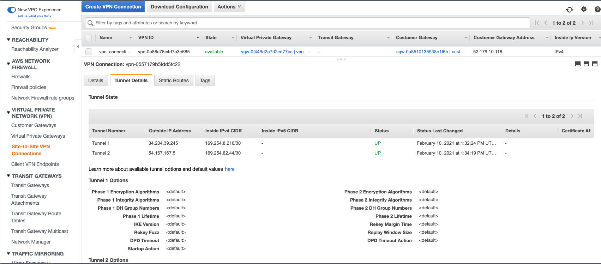
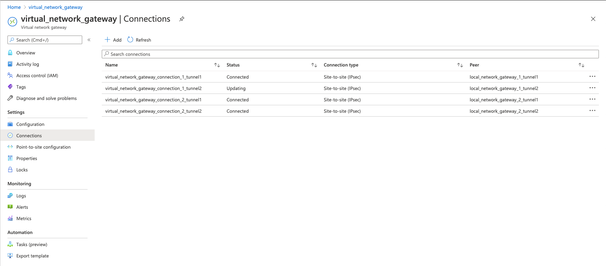
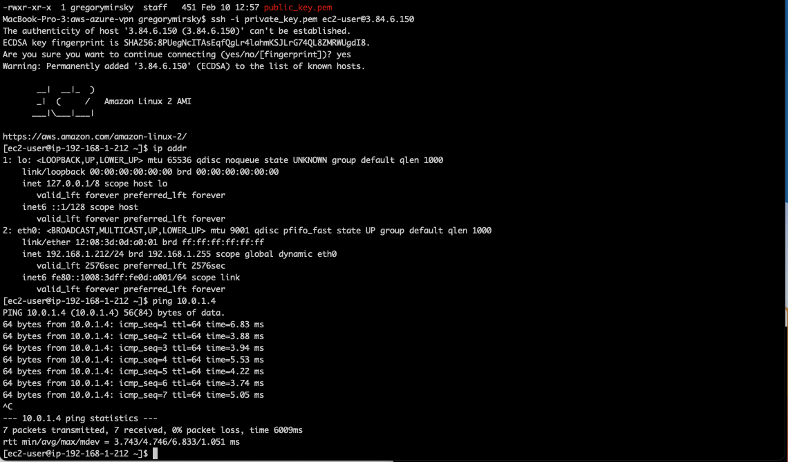
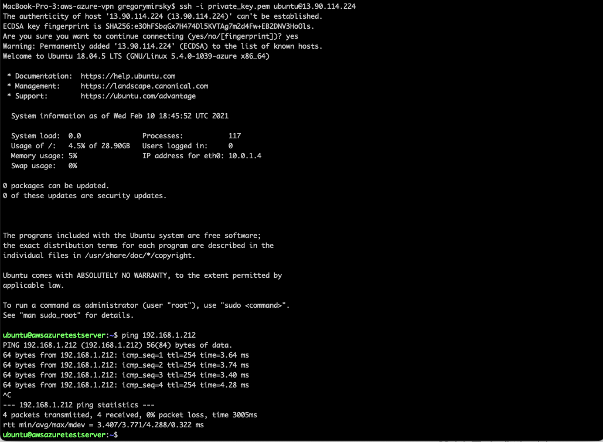

# AWS to Azure site to site VPN provisioned with Terraform

Terraform code to deploy a highly available site-to-site VPN between AWS and Azure.

This script will create a tunnel between an AWS VPC and an Azure vNet, connecting resources from each cloud provider as if they were in the same local network.

The configuration is highly available so that it has enough resources to avoid any disruption during a  cloud provider maintenance window.

## Architecture

The main script contains all the necessary HCL commands for terraform to provision the VPN. There are also multiple local modules used to compartmentalize the logic for processing AWS specific user tags, Azure specific user tags, Azure region naming and finally the creation of test servers to test the functionality of the VPN gateways and tunnels.

Additionally logic is compartmentalized for reusuability and for code hygiene by using the following terraform modules:

- Module: `aws_user_tags` - This module gets AWS specific information such as the user ARN and puts it into a tag so that other administrators know who created the resource without having to scan the cloudwatch logs.

- Module: `azure_user_tags` - This module gets Azure specific information such as the user display name, client id, etcetera and puts it into a tag so that other administrators know who created the resource without having to scan the Azure logs.

- Module: `aws_ami-search` - This module automates finding the latest AWS ami image id for the selected operating system to be provisioned.

- Module: `azure-region` - This module will handle the various naming conventions for Azure regions that differ from the console and the CLI.

- Module: `create_test_vms` - This module will create a AWS EC2 instance and a Azure VM in the respective environemnts to test the VPN tunnel for connectivity.

- Module `key-pair` - This public module from the [Terraform Registry](https://registry.terraform.io/modules/terraform-aws-modules/key-pair/aws/latest) handles all the AWS key pair processing. The output is also used by the module `create_test_vms`.

## Programming and Operational Notes

Be aware that this script can take over thirty (30) minutes to complete due to the length of time it takes to create gateways in both AWS and Azure.

To change the AWS region you must change the region in the AWS provider stanza in the file: `provider.tf`. It is currently set to us-east-1 in this repository. At this time you can not parameterize this value in terraform.

The `azurerm_subnet.subnet_gateway.name = "GatewaySubnet"`in `azurerm_subnet.tf`  is mandatory and only one "GatewaySubnet" is allowed per vNet in Azure. Leave this value alone.

The allocation_method in `azurerm_public_ip` in file `azurerm_public_ip.tf` must be set to dynamic. Public IP needs to be dynamic for the Virtual Network Gateway. The IP address will be dynamically generated after being attached to the Virtual Network Gateway.

The BGP (Border Gateway Protocol) ASN  (Autonomous System Numbers) is set to 65000 (Private ASN) on the AWS Customer Gateway as required by AWS.

This script uses Terraform’s `data resource` to fetch the two public IP addresses from AWS. This is because the two IP addresses are `Dynamic` and are generated only after Azure’s Virtual Network Gateway is up and running.  The `azurerm_public_ip` data resource has an interpolated name so that the script can cope with inter-cloud dependencies.

This is critical in getting the Azure public IP addresses, which are generated only after the Virtual Network Gateway is created and has to used as input on the AWS provisioning side of the VPN. Using the interpolation in the `name` argument forces the data resource to be executed only after the Azure Virtual Network Gateway is created.

Using the Terraform `depends_on` clause causes issues when dealing with two differnt cloud providers. The `depends_on` clause forces the read of the data source to always happen in the apply phase and therefore it triggers changes in the AWS components depending on what resources have provisioned first. This causes the VPN configuration to never converge and thus a loss of connectivity.

In general, it is suggested to build all new or to destroy. Especially if you have any type of auto-tagging installed in your environment. Incremental applies may not work they way you are used to in Terraform due to the nature of the two competing cloud providers and how they are architected and how they provision assets.

Each `AWS VPN Connection` created has *two tunnels* with IP addresses and secret keys. To accomplish full high availability, we point each Azure Virtual Network Gateway IP address to the two IP addresses on AWS thus creating a connection mesh.

In the end we wind up with:

- Four Local Network Gateways, one for each AWS VPN tunnel.
- Four Virtual Network Gateway connections, one for each AWS VPN tunnel.

## Provisioning with Terraform

Adjust the values in the terraform.tfvars file to reflect your needs and environment. Remember if you change the AWS region you need to modify the `provider.tf` file too.

```bash
custom_tags = {
  project  = "AWS to Azure VPN"
  Jira     = "AWS-917"
  test_tag = "This is a test tag!"
}
application_code_name             = "aws-azure-vpn"
associate_public_ip_address       = true
aws_cidr_block                    = "192.168.0.0/16"
aws_instance_type                 = "t2.micro"
aws_os                            = "amazon-2_lts"
aws_region                        = "us-east-1"
aws_subnet_cidr_block             = "192.168.1.0/24"
azure_cidr_block                  = "10.0.0.0/16"
azure_region                      = "us-east"
azure_subnet_cidr_block_1         = "10.0.1.0/24"
azure_subnet_cidr_block_2         = "10.0.2.0/24"
azure_virtual_network_gateway_sku = "VpnGw1"
create_test_vms                   = true
environment                       = "dev"
azure_publisher                   = "Canonical"
azure_offer                       = "UbuntuServer"
azure_sku                         = "18.04-LTS"
azure_version                     = "latest"
```

Use the following commands to find the appropriate Azure VMs if you do not want to use the default Ubuntu Server 18.04 LTS image.

```bash
az vm image list --output table

az vm image list --offer UbuntuServer --all --output table
```

More detailed information about finding Azure VM images can be found [here.](https://docs.microsoft.com/en-us/azure/virtual-machines/linux/cli-ps-findimage)

Use the following commands to find the appropriate AWS AMI if you do not wish to use the default Amazon Linux 2 image

```bash
aws ec2 describe-images --owners self amazon
```

More detailed information about finding AWS images can be found [here.](https://docs.aws.amazon.com/AWSEC2/latest/UserGuide/finding-an-ami.html)

### Terrafrom provisioning

To initiate the provisioning of the resources in AWS and Azure perform the following commands:

```bash
terraform init
```

The init command will load up the terraform modules and providers into your environment.

```bash
terraform fmt
```

The fmt (formt) command, will format your code and also spot any glaring errors like missing quotes, commas, etcetera.

```bash
terraform validate
```

The validate command will perform a more in depth error checking of your terraform code.

```bash
terraform plan -out=tfplan
```

The plan command will create a blueprint of what terraform plans to do. Review the output to make sure it will do what you want it to do. This script will provision 40+ resources across the AWS and Azure environments.

```bash
terraform apply tfplan
```

The apply command will execute what terraform planned in the plan command and provision the cloud resources to both the AWS and Azure clouds simultaneously.

```bash
terraform destroy
```

The destroy command will remove all the assets provisioned from both AWS and Azure.

## Testing the VPN connection and connectivity

On AWS, go to **VPC > Site-to-Site VPN Connections** and take a look at the Tunnel Details tab under vpn_connection_1 and vpn_connection_2. The VPN connection should be "available" and the two tunnels should in a "up" status.



On Azure, go to **Virtual Network Gateways > Connections** and check to see if all the connections are in a "connected" status.



In the above screen shot we can see one connection is stuck in the "updating" status. This seems to be a known issue with Azure virtual network gateways. You can reset the gateway with the following instructions from Microsoft for [resetting a gateway](https://docs.microsoft.com/en-us/azure/vpn-gateway/reset-gateway).

Connect to each instance/vm via the public IP on the respective servers and then ping the other's private IP address to test the connectivity over the VPN.

The private_key.pem file is generated and saved in the root terraform directory of this script.

In the below screen shots our AWS server has an IP address of `192.168.1.212` and its counterpart in Azure has a IP address of `10.0.1.4`

### AWS



### Azure



## Clean up

Occasionally I have found that Azure does not always tear down its virtual network gateways and you will need to force the deletion of the whole resource group to delete the assets if Terraform floats up an error from Azure in the terraform destroy processes.

For more information on forcibley removing Azure resource groups go [here.](https://docs.microsoft.com/en-us/azure/azure-resource-manager/management/delete-resource-group?tabs=azure-powershell)
